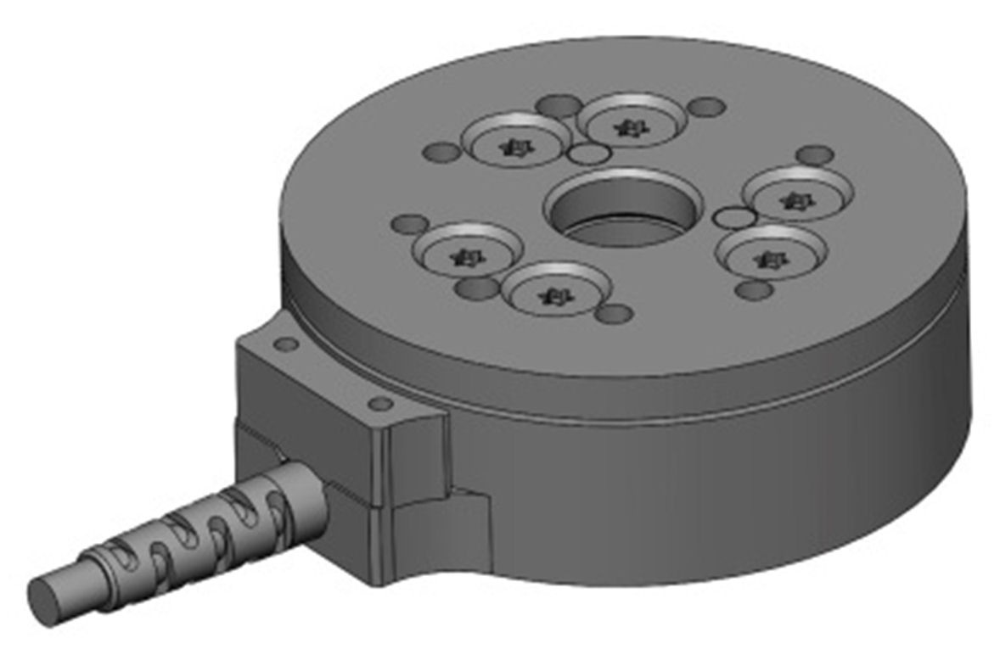
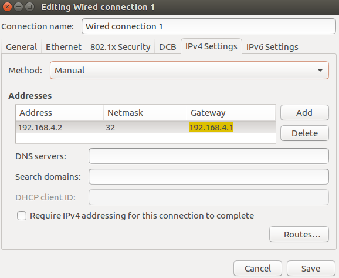

# ati_ft_sensor
<br>  

## What is it

Interface using internet connexion to a ATI force torque sensor.

## Usage with rt_preempt

The ATI FT sensor is connected to the control PC via ethernet. To access the ATI sensor from the computer, the network connection to the ATI sensor must be configured.

- On Ubuntu, open the application "Network connections"
- Note: Please use ifconfig to identify the port to which the ethernet cable is connected.  To verify if you have identified the right port check if the Hwaddress in Ifconfig matches with the number in the General tab in "Network connection".
- If you configure the wrong port, the computer will not be able to connect with the internet. In which case, undo your changes and run "sudo service network-manager restart".
- Select the network connection which connects to the ATI sensor. For this, you might want to use the command ifconfig on the terminal to see the mac addresses of all network devices.
- In the "IPv4 Settings" tab, specify the network connection parameters manually by switching "Method" to "Manual" and put in the values as shown in the screenshot  
<br>  

### Note
> :warning: In case you installed an LDAP account on the computer be aware that configuring the network card as described above might cause problems when rebooting the PC. Particularly, Ubuntu tries to connect to LDAP using the network settings from the hardcoded network connection, which will not work. In case you experience such issues at the first logging after a reboot, remove the network connection to the ATI sensor and restart the computer. Once you manged to login, connect the ATI sensor again.

> :warning: In case after restart you are unable to login to you LDAP account, please login to administrator(if you do not know the login credentials, please ask Vincent), and run "sudo service network-manager restart" and then restart the computer if necessary.  

> :warning: In case of socket error: ```cannot bind socket, error: 98, Address already in usehardware communication loop started```  
Make sure all of the processes for dynamic_graph and ATI sensor are killed.

## Hardware specs
You can find more detail in below links:
- [Datasheet](https://github.com/open-dynamic-robot-initiative/ati_ft_sensor/blob/master/doc/mini_40_datasheet.pdf)
- [Technical Drawing Sensor](https://github.com/open-dynamic-robot-initiative/ati_ft_sensor/blob/master/doc/mini_40_drawing.pdf)
- [Thecnical Drawing Net Box](https://github.com/open-dynamic-robot-initiative/ati_ft_sensor/blob/master/doc/net_box_9105_a.jpg)
- [Quote](https://github.com/open-dynamic-robot-initiative/ati_ft_sensor/blob/master/doc/20170925_angebot_schunk_ati_sensor.PDF)
- [Schunk - Exclusive Distributor](https://github.com/open-dynamic-robot-initiative/ati_ft_sensor/blob/master/doc/20170925_schreiben_exklusivvertrieb_schunk.pdf)
- [Quick Start Guide](https://github.com/open-dynamic-robot-initiative/ati_ft_sensor/blob/master/doc/9610-05-1022%20Quick%20Start.pdf)  
These information is downloaded from the manufacturer's website, and we are not responsible for any information that they contain.

## Authors

- Ludovic Righetti
- Alexander Herzog
- Maximilien Naveau
- Elham Daneshmand

## Copyrights

Copyright (c) 2019, New York University and Max Planck Gesellschaft.

## License

License BSD-3-Clause
